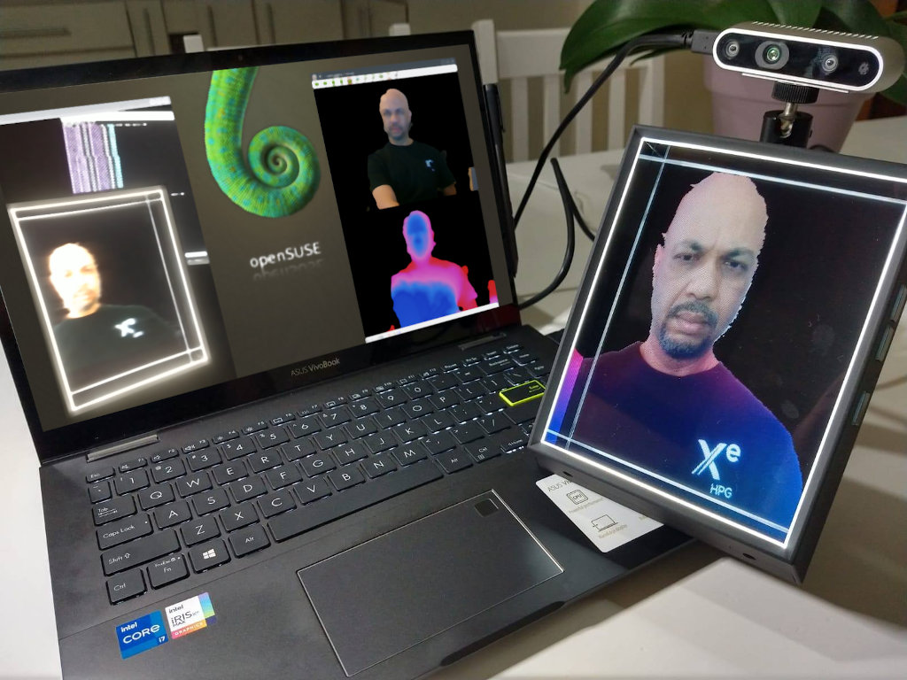
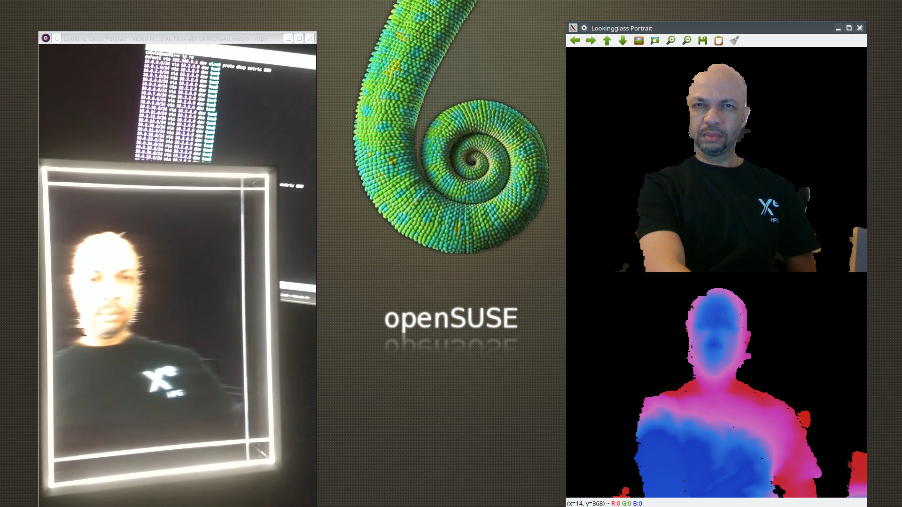

# rscreatelg - Realsense Video Creator for Looking Glass Portrait

**Author:** Alessandro de Oliveira Faria (A.K.A. CABELO)

## About the project

This software was created for generate video holographic for the Looking Glass holographic displays. I am not associated with the Looking Glass Factory and devoloped in my freetime this project for to use Looking Glass in GNU/lINUXI. I use the opencv library and admire camera realsense as well as the amazing new holographic display technology created by [Looking Glass Factory] (https://lookingglassfactory.com/).

## About the Repository
This repository is to provide an alpha version of the project for anyone who wants to try it out. Please be aware that this alpha version may contain errors. If you find a bug or have any ideas to improve it, open an issue in this repository with a detailed description. Thanks for your help and have fun mixing your holograms! 

